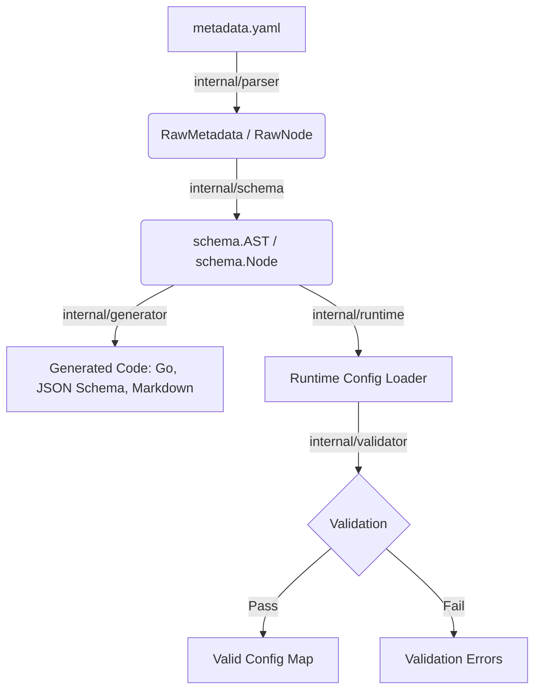

# Codrao Compiler Pipeline Architecture

This document describes the end-to-end architecture of Codrao, detailing how configuration specifications (`metadata.yaml`) flow from raw text into strongly-typed code and validated runtime states.

The pipeline is intentionally divided into four distinct phases. If you are a new contributor looking to fix a bug or add a feature, this guide will help you pinpoint exactly which package you need to work in.

---

## High-Level Data Flow

---

## 1. Parser (`internal/parser`)

**Purpose:** Syntactic analysis of the YAML specification.

- **What it reads:** Raw YAML byte streams (`io.Reader` or file) containing the user's `metadata.yaml`.
- **What it validates/transforms:** It ensures the file is valid YAML and structurally matches the Codrao specification format. It differentiates between "namespaces" (nested objects) and "leaf fields" (configuration variables).
- **What it outputs:** A generic, untyped intermediary tree.
- **Key Types/Interfaces:**
  - `RawMetadata`: The root wrapper containing the parsed data.
  - `RawNode`: Represents an individual field or namespace in the raw YAML.

*Work here if:* You are adding support for a new keyword in `metadata.yaml` or fixing a YAML syntax parsing issue.

---

## 2. AST Builder (`internal/schema`)

**Purpose:** Semantic analysis and construction of the Abstract Syntax Tree (AST).

- **What it reads:** `parser.RawMetadata`.
- **What it validates/transforms:** Normalizes raw string types into enum-backed `FieldType`s. It builds the canonical dotted paths (`database.host`), sets up default values, and validates that attribute combinations make sense (e.g., throwing an error if a user sets `min: 10` on a boolean field).
- **What it outputs:** The formal semantic AST representing the configuration schema.
- **Key Types/Interfaces:**
  - `AST`: The root tree structure.
  - `Node`: A configuration namespace.
  - `Field`: A validated leaf field with strict typing and constraints.
  - `FieldType`: Strongly-typed enum mapping to language-agnostic primitives (e.g., `TypeString`, `TypeInt`).

*Work here if:* You are adding a new data type (like `duration` or `ip_address`) or a new validation constraint keyword (like `maxLength`).

---

## 3. Generator (`internal/generator`)

**Purpose:** Translating the AST into target languages and artifacts.

- **What it reads:** The strictly-typed `schema.AST`.
- **What it validates/transforms:** It recursively visits the AST and templates it into idiomatic target code (like Go structs with tags) or documentation.
- **What it outputs:** Written output to `io.Writer` interfaces (files).
- **Key Types/Interfaces:**
  - `Generator` (interface): Defines the `Generate(ast *schema.AST, out io.Writer)` contract.
  - `GoCodeGenerator`: Produces `generated_config.go`.
  - `JSONSchemaGenerator`: Produces a standard JSON Schema document.
  - `MarkdownGenerator`: Produces developer documentation.

*Work here if:* You are adding a generator for a new language (e.g., TypeScript, Python, Rust) or modifying the output formatting of an existing generator.

---

## 4. Runtime & Validator (`internal/runtime` + `internal/validator`)

**Purpose:** Managing application configuration loading and enforcement at runtime.

- **What it reads:** The `schema.AST` (compiled into the binary) alongside actual runtime configuration values (from `config.yaml`, environment variables, etc.).
- **What it validates/transforms:**
  - **`internal/runtime`**: Loads the values, handles environment variable overrides (translating `DATABASE_HOST` to `database.host`), and merges defaults.
  - **`internal/validator`**: Takes the loaded values and checks them against the constraints defined in the `schema.AST`.
- **What it outputs:** A validated, thread-safe runtime configuration map or a sorted list of strongly-typed validation errors.
- **Key Types/Interfaces:**
  - `runtime.Loader`: Handles merging files, defaults, and env vars.
  - `validator.ValidationErrors`: A slice of constraint violations indicating exactly which field failed which rule.

*Work here if:* You are adding support for new configuration sources (like CLI flags, remote key-value stores), fixing environment variable overriding, or implementing the logic for new validation rules (e.g., running regex checks).
