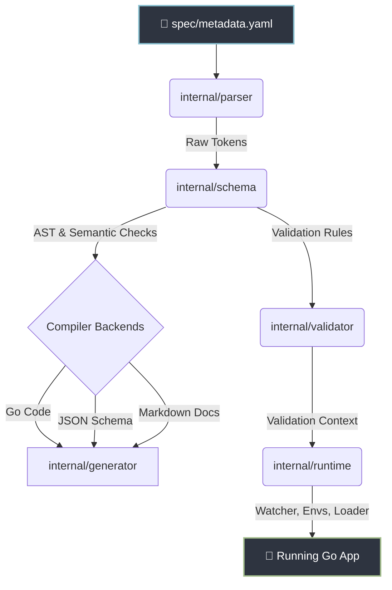

# codrao

A modern semantic configuration management and code-generation framework for Go.

## Overview

In traditional Go architectures, configuration management usually means manually creating structs, writing endless validation boilerplate, and struggling with silent failures when environment variables are missing.

`codrao` takes a radically different approach: it **separates configuration specification from configuration data**. 

You define your schema, default values, and strict validation rules (like regex patterns, min/max boundaries, and enums) in a single YAML metadata file. `codrao` then acts as a compiler—generating type-safe Go structs, functional getters, JSON schemas for IDE auto-complete, and automatically handling environment variable overrides and file-watching hot-reloads at runtime.


##  Key Features

- ** Single Source of Truth**: Define your entire application's configuration schema in one clear `metadata.yaml` file.
- ** Compile-Time Safety**: Generates strictly-typed Go structs with a safe Functional API. No more `map[string]interface{}` or typos!
- ** Semantic Validation**: Enforce required fields, numeric boundaries, string regexes, and enums *before* your app starts.
- ** Environment Overrides**: Automatically maps environment variables to configuration paths without any extra code.
- ** Hot Reloading**: Built-in runtime file watcher that can safely reload configurations on the fly.
- ** IDE Auto-Complete**: Generates standard Draft-07 JSON Schemas so your configuration files get rich auto-complete in VSCode/IntelliJ.
- ** Auto-Documentation**: Compiles beautiful Markdown documentation directly from your schema descriptions.

---

##  Quick Start

Get your application fully configured with type-safety in under 2 minutes.

### 1. Declare your Specification (`metadata.yaml`)
Create a schema defining a `server` object with validation constraints:
```yaml
server:
  host:
    type: string
    default: "localhost"
  port:
    type: int
    default: 8080
    min: 1
    max: 65535
    description: "Port to listen on"
  api_key:
    type: string
    pattern: "^[A-Z0-9]{16}$"
    required: true
```

### 2. Generate Structs & Code
Compile the metadata into typed Go structures and a Functional Getter API:
```bash
codrao generate --metadata metadata.yaml --out ./config --functional-api
```

### 3. Provide your Data (`config.yaml`)
Create the actual configuration data file containing your environments overrides:
```yaml
server:
  port: 9000
  api_key: "MYSECRETAPIKEY12"
```

### 4. Load & Validate in Go
Load the config at startup. `codrao` will automatically inject your defaults (e.g., `host: "localhost"`) and rigorously validate constraints:
```go
package main

import (
	"fmt"
	"log"

	"github.com/SSOHEB/codrao/internal/runtime"
	"github.com/SSOHEB/codrao/internal/schema"
	"github.com/SSOHEB/codrao/internal/parser"
)

func main() {
	rawMeta, _ := parser.ParseFile("metadata.yaml")
	ast, _ := schema.Build(rawMeta)

	cfg, _, err := runtime.LoadAndPrepareFile[Config](ast, "config.yaml")
	if err != nil {
		log.Fatalf("Invalid configuration: %v", err)
	}

	fmt.Printf("Starting server on %s:%d...\n", cfg.Server().Host(), cfg.Server().Port())
}
```

---

## 📦 Installation

### Pre-built Binaries
Download the compiled release binary for your OS and architecture directly from the [Releases page](https://github.com/SSOHEB/codrao/releases).

```bash
curl -LO https://github.com/SSOHEB/codrao/releases/download/v0.1.0/CODRAO_0.1.0_linux_amd64.tar.gz
tar -xzf CODRAO_0.1.0_linux_amd64.tar.gz
sudo mv codrao /usr/local/bin/
```

### From Source
```bash
go install github.com/SSOHEB/codrao/cmd/codrao@latest
```

### Via Docker
```bash
docker run --rm -v ${PWD}:/workspace -w /workspace ghcr.io/ssoheb/codrao:latest defaults -m metadata.yaml
```

---

##  Architecture

`codrao` operates as a compiler pipeline, cleanly separating frontend YAML parsing from backend code generation and runtime execution:



---

##  CLI Reference

All commands support the `--metadata` (`-m`), `--config` (`-c`), and `--out` (`-o`) flags.

| Command | Description | Example |
|---|---|---|
| `defaults` | Prints a formatted table of all config paths and defaults | `codrao defaults -m metadata.yaml` |
| `validate` | Validates a config file against semantic constraints | `codrao validate -m metadata.yaml -c config.yaml` |
| `generate` | Compiles JSON Schemas and typed Go structs | `codrao generate -m metadata.yaml -o ./generated` |
| `schema` | Prints the JSON Schema document (`-w` to write to file) | `codrao schema -m metadata.yaml` |
| `docs` | Generates structured Markdown documentation | `codrao docs -m metadata.yaml -o ./docs` |
| `version` | Displays version, commit hash, and build timestamp | `codrao version` |

---

##  Testing

`codrao` maintains rigorous quality standards via a multi-tiered testing pyramid:

- **Unit Tests:** `make test` - Verifies internal package business rules.
- **Golden Tests:** `make test-golden` - Prevents output drift against pre-recorded expectations.
- **Integration Tests:** `make test-integration` - Verifies black-box CLI command executions.
- **Benchmarks:** `make bench` - Measures execution performance and memory footprints.

---

##  Contributing

We welcome contributions from the community! 

Please refer to our [CONTRIBUTING.md](CONTRIBUTING.md) for guidelines on setting up your local environment, running the testing tiers, and code conventions. Be sure to review our [Code of Conduct](CODE_OF_CONDUCT.md) before participating.

---

<div align="center">
  Released under the <a href="LICENSE">MIT License</a>.
</div>
